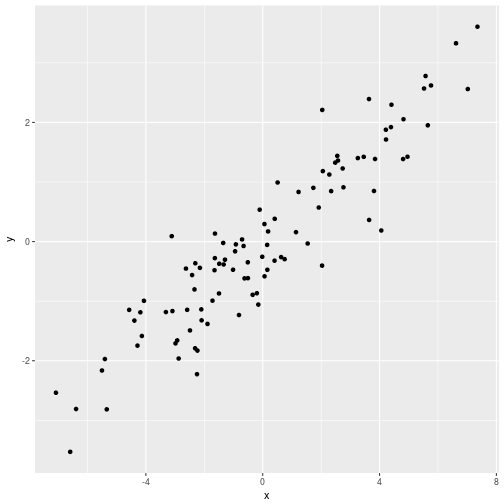

# Quantitative Genetics

## A Review of Statistics

<small>
Instructor: [A Augusto F Garcia](http:augustogarcia.me)
/ [Statistical Genetics Lab](http://statgen.esalq.usp.br) </small>

<small>Department of Genetics, Luiz de Queiroz College of Agriculture,
University of São Paulo (Brazil)</small>

<script src="http://ajax.googleapis.com/ajax/libs/jquery/1.9.1/jquery.min.js"></script>

  
*** =pnotes

Some notes on the first slide

---

# Content

### Expectation
### Variance
### Covariance
### Regression
### Correlation

---

### Probability distribution

- We will denote $z$ for a random variable (quantitative trait,
  phenotype)

- $p(z)$ (probability density function) 


$\int_{-\infty}^{+\infty} p(z) dz = 1$

$P(z_1\leq z \leq z_2)=\int_{z_1}^{z_2}p(z) dz$

---

### Normal distribution

$$f(z)=\frac{1}{\sqrt{2\pi\sigma^{2}}}e^{\frac{-(z-\mu)^2}{2\sigma^{2}}}$$


---

# Expectation

- First moment about the origin, **expected value**, expectation, mean

$$E(z)=\mu=\int_{-\infty}^{+\infty} z \, p(z) \, dz$$

- Properties

  - $E(x+y)=E(x)+E(y)$
  - $E(cx)=c E(x)$

---

# Variance

- Second moment about the mean

$$\sigma^2=\int_{-\infty}^{+\infty} (z-\mu)² \, p(z) \, dz=E[(z-\mu)^2]$$

$$\sigma² = E(z^2)-[E(z)]^2$$

If $z$ are deviations around the mean (e. g. after scaling)

$\sigma^2=E(z^2)$

---

### Formula

$$\sigma^2=\frac{1}{n-1}\left[ \sum z^2 - \frac{(\sum z)^2}{n} \right]$$


```r
z <- c(1,3,4,8,2,7)
z
```

```
## [1] 1 3 4 8 2 7
```

```r
a <- sum(data^2)
a
```

```
## [1] 143
```

```r
b <- (sum(data))^2
b
```

```
## [1] 625
```

```r
(v <- (a-b/6)/5)
```

```
## [1] 7.766667
```

```r
var(z)
```

```
## [1] 7.766667
```

---

## A measure of dispersion


```r
var(c(2,3,3,4,5,6,6))
```

```
## [1] 2.47619
```

```r
var(c(0,1,3,5,6,7,9))
```

```
## [1] 10.61905
```

---

## Joint Distribution


$$P(y_1 \leq y \leq y_2, \, x_1 \leq x \leq x_2) =
\int_{y_1}^{y_2}\int_{x_1}^{x_2} p(x,y) \, dx\, dy$$


- Conditional probabilities
$$P(y_1 \leq y \leq y_2 | x) = \int_{y_1}^{y_2} p(y|x) \, dy$$

- Remember that
$$p(x,y)=p(y|x) \, p(x)$$

- Expectation
$$E[f(x,y)]=\int_{-\infty}^{+\infty} \int_{-\infty}^{+\infty}
f(x,y)\,p(x,y)\,dx \, dy$$

---

# Covariance

$$\sigma(x,y)=E[(x-\mu_x)(y-\mu_y)]$$

$$\sigma(x,y)=E(xy)-\mu_x \mu_y=E(xy)-E(x)\,E(y)$$

---

### Formula

$$\sigma(x,y)=\frac{1}{n-1}\left[ \sum xy - \frac{\sum x \sum y}{n} \right]$$


```r
x <- c(1,3,4,8,2,7)
y <- c(2,4,3,9,4,9)

(a <- sum(x*y))
```

```
## [1] 169
```

```r
b <- (sum(x)*sum(y))
b
```

```
## [1] 775
```

```r
(Cov <- (a-b/6)/5)
```

```
## [1] 7.966667
```

```r
cov(x,y)
```

```
## [1] 7.966667
```

---

### Covariance

- Measure of **linear association** between $x$ and $y$


```
##          [,1]     [,2]
## [1,] 9.478564 2.506905
## [2,] 2.506905 1.585234
```


---


```
##            [,1]       [,2]
## [1,]  9.3107078 -0.3321092
## [2,] -0.3321092  1.8144215
```


---


```
##           [,1]     [,2]
## [1,] 10.787758 4.402369
## [2,]  4.402369 2.104108
```



---


```
##           [,1]      [,2]
## [1,]  8.550804 -3.714634
## [2,] -3.714634  1.865854
```


---

## Useful Identities

$a$ is a constant, $x$ and $y$ are random variables

- $\sigma(x,x)=\sigma^2(x)$
- $\sigma(a,x)=0$
- $\sigma(ax,y)=a \, \sigma(x,y)$
- $\sigma(ax,by)=ab \, \sigma(x,y)$
- $\sigma^2(ax)=a^2\sigma^2(x)$
- $\sigma[(x+y),(w+z)]=\sigma(x,w)+\sigma(x,z)+\sigma(y,w)+\sigma(y,z)$
- Very important:
$$\sigma^2(x+y)=\sigma^2(x)+\sigma^2(y)+2\sigma(x,y)$$

---

# Regression

- Linear models: a very good approximation for initial studies
- For associations:
$$y = \alpha + \beta x + e$$
- $y$ predicted by the model:
$$\hat{y} = \alpha + \beta x$$
- $x$ is the predictor (or independent variable)
- $y$ is the response (dependent variable)
- $\alpha$ and $\beta$ are estimated to give the best fit to the joint
  distribution of $x$ and $y$

---

### Least Squares

- Criteria: minimize $\bar{e^2}$
- Recall that $e$ are deviations, so $E(e^2)$ is the residual variance
- $e=y-\hat{y}=y-a-bx$
- After some derivations:
  $$a= \bar{y} - b\bar{x}$$
  $$b=\frac{Cov(x,y)}{Var(x)}$$
- This shows the relation between covariance (dependence) and the
  slope of the linear regression

---

### Properties

- $E[e]=0$
- The amount of the variance of $y$ explained by the regression is
  maximum
- $Cov(x, e)=0$

---

# Correlation

- A dimensionless measure of association
  $$r(x,y)=\frac{Cov(x,y)}{\sqrt{Var(x)\,Var(y)}}$$
- Therefore,
  $$b(y,x)=r\sqrt{\frac{Var(y)}{Var(x)}}$$
- $r^2$: coefficient of determination (proportion of variance of $y$
  explained by the regression)
  - Regression variance:
  $$r^2 Var(y)$$
  - Residual variance
  $$(1-r^2) Var(y)$$

--- ds:orange


```
## [1] 0.559017
```


--- ds:orange


```
## [1] 0
```


--- ds:orange


```
## [1] 0.8944272
```


--- ds:orange


```
## [1] -0.9391486
```


---  ds:blue

# Example

### Correlation between genotypic and phenotypic values

$$z = G + E$$

$\sigma(z,G)=\sigma[(G + E),G]=\sigma(G,G)+\sigma(E,G)=\sigma^2_G + \sigma_{G,E}$

$\rho(G,z)=\frac{\sigma_{G,z}}{\sigma_G \sigma_z}=\frac{\sigma^2_G +
\sigma_{G,E}}{\sigma_G \sigma_z}$

- If $\sigma_{G,E}=0$:

$$H^2=\rho^2(G,z)=\frac{\sigma^2_G}{\sigma^2_z}$$

know as the **heritability in the broad sense** (proportion of the
total phenotypic variance that is explained by genetic factors)

--- ds:indigo


# Homework

  - Read Chapter 2 and 3 of Lynch and Walsh Book
